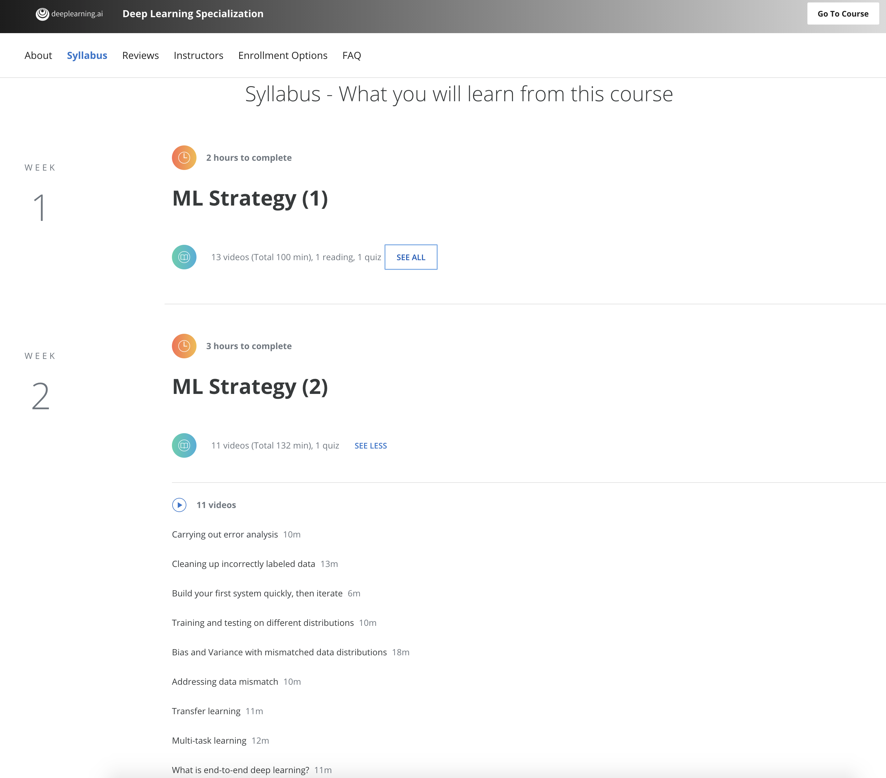
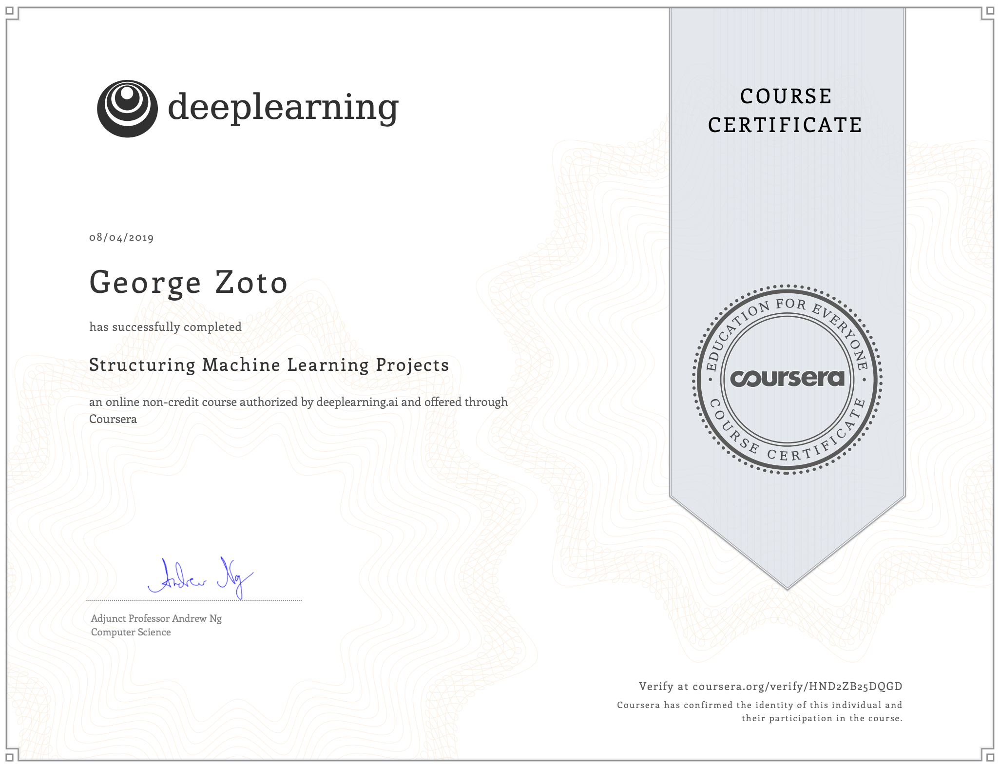

# Structuring-Machine-Learning-Projects
Structuring Machine Learning Projects repository for all projects and programming assignments of Course 3 of 5 of the Deep Learning Specialization offered on Coursera and taught by Andrew Ng, CEO/Founder Landing AI; Co-founder, Coursera; Adjunct Professor, Stanford University; formerly Chief Scientist, Baidu and founding lead of Google Brain.

**Being a technical leader in AI**  
* Building successful machine learning projects and know how to set direction for my team's work

**Structuring Machine Learning Projects**
* Orthogonalization  
* Setting up my goal  
* Comparing to human-level performance  
* Bird recognition assignment
* Error Analysis  
* Mismatched training and dev/test set  
* Transfer learning  
* Multi-task learning  
* End-to-end deep learning  
* Autonomous driving assignment

Much of this content has never been taught elsewhere, and is drawn from Prof. Andrew's experience building and shipping many deep learning products. This course also has two "flight simulators" that let you practice decision-making as a machine learning project leader. This provides "industry experience" that you might otherwise get only after years of ML work experience. He mentions seeing teams waste months or years through not understanding the principles taught in this course and hopes this course will save us months of time.

After this course I learned: 
- How to diagnose errors in a machine learning system, and 
- How to prioritize the most promising directions for reducing error
- Understand complex ML settings, such as mismatched training/test sets, and comparing to and/or surpassing human-level performance
- How to apply end-to-end learning, transfer learning, and multi-task learning

  

  

# Links:  
https://www.coursera.org/learn/machine-learning-projects  
https://www.coursera.org/specializations/deep-learning  
https://www.deeplearning.ai  
http://karpathy.github.io  
https://paperswithcode.com/sota  
https://www.coursera.org/account/accomplishments/verify/HND2ZB25DQGD  
